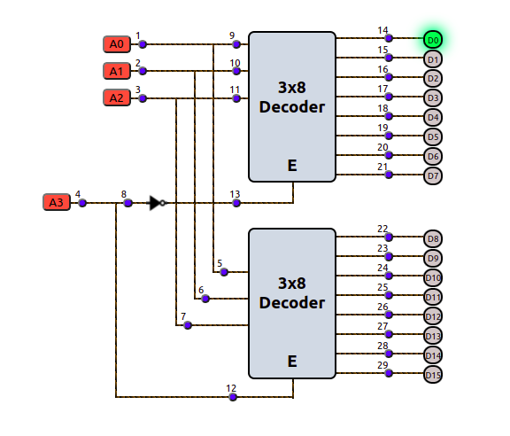
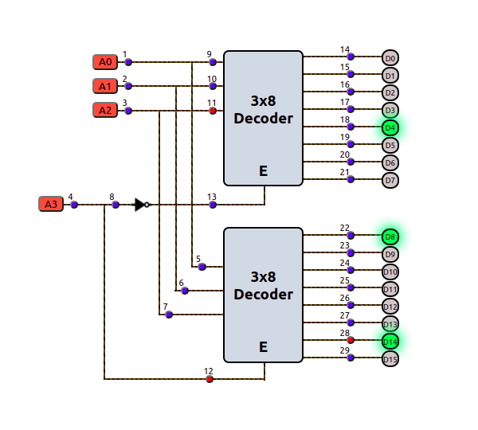

### Introduction

### Stuck at fault

After manufacturing a chip, the number of physical defects it may have can be extremely large, potentially infinite. In many cases, it becomes impractical to count and analyze all possible faults. Therefore, during the testing of a circuit or IC, physical defects are abstracted, and logical fault models are used for analysis.

In this way
<ul> 
 <li>It helps in narrowing down the number of faults that need to be addressed.</li> 
 <li>Enables the generation of tests and the simulation of faults.</li>
 <li>Allows for a quantitative comparison of test sets to minimize faults as much as possible.</li> 
</ul>

<strong>Note:</strong> Defining fault models doesn't imply that the circuit actually has these faults; it simply assumes the circuit behaves in that manner for analysis purposes.

Fault modeling can be done at various levels of abstraction, including Behavioral, Functional, Structural, Switch level, and Geometrical. Among these, the stuck-at fault model falls under the Structural level. It is categorized into two types: Single stuck-at fault modeling and Multiple stuck-at fault modeling.

Among the two, single stuck-at fault modeling is the most widely used. This is because:

1. Its simplicity makes it highly effective and widely adopted for testing integrated circuits (ICs).
2. Interestingly, a test set that detects all single stuck-at faults can also detect over 95% of multiple stuck-at faults.
3. In tree-like circuits, it is capable of detecting all multiple stuck-at faults.

### Decoder 

A decoder is a combinational logic circuit that translates binary information from n input lines into a maximum of 2n distinct output lines.

 

Sometimes, an additional input called "Enable" is provided to control the activation of the circuit. The decoder is active when the Enable input is at logic level "1" and inactive when it is at logic level "0". Essentially, the decoder translates the binary-coded inputs into a corresponding output. Since n bits can represent 2n combinations, the decoder uses n inputs to activate one specific output line (set to "1"), while all other output lines remain at "0".

### 4x16 decoder using 3x8 decoder 

The parallel inputs A0, A1, and A2 are applied to both 3x8 decoders, while an additional input A3 serves as the enable signal. Depending on the value of A3, one of the two decoders is activated: when A3 is '0', the first decoder is enabled, producing outputs D0 to D7 (representing the first eight minterms); when A3 is '1', the second decoder is enabled, generating outputs D8 to D15 (representing the last eight minterms).

 

### Effect of stuck at fault 

When there are no stuck-at faults in a circuit, it functions correctly. However, achieving a digital circuit completely free of stuck-at faults is nearly impossible. Fortunately, various detection techniques can identify these faults to a certain extent. These techniques involve applying different test sets to detect stuck-at faults at specific positions within the circuit.

To reduce the number of required test sets—since their quantity grows exponentially with the number of input lines, output lines, and fan-out branches—we apply certain principles such as the Law of Dominance and the Law of Equivalence. A circuit with numerous faulty lines tends to behave abnormally, as those lines are fixed at incorrect logic levels. Therefore, to ensure proper circuit functionality, it is essential to minimize the presence of stuck-at faults as much as possible.

 

 
In the above figure, stuck-at-1 faults at positions 11, 12, and 28 result in abnormal outputs from the 4x16 decoder.

