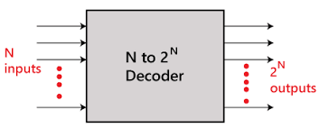

### Introduction

### Stuck at fault

After a chip is manufactured, the number of possible physical defects can be extremely large—potentially even infinite. Because of this, identifying and analyzing every individual defect is impractical. To manage this complexity during testing, these physical defects are instead represented using logical fault models, which simplify the analysis.

In this way
<ul> 
 <li>It helps in narrowing down the number of faults that need to be addressed.</li> 
 <li>Enables the generation of tests and the simulation of faults.</li>
 <li>Allows for a quantitative comparison of test sets to minimize faults as much as possible.</li> 
</ul>

This approach offers several advantages:

<ul>
<li>>Reduces the scope of faults that need to be analyzed.</li>
<li>Facilitates test generation and fault simulation.</li>
<li>Enables quantitative comparison between test sets to optimize fault coverage.</li>
</ul>

<strong>Note:</strong> The use of fault models doesn't imply that the circuit actually contains these faults. Rather, it assumes such behavior to aid in the analysis.

Fault modeling can be carried out at different levels of abstraction, including:

<ul>
 <li>Behavioral</li>
  <li>Functional</li>
  <li>Structural</li>
  <li>Switch level</li>
  <li>Geometrical</li>
</ul>

Among these, the stuck-at fault model belongs to the structural level. It comes in two main types:

<ol>
 <li>Single stuck-at fault model</li>
 <li>Multiple stuck-at fault model</li>
</ol>

The single stuck-at fault model is the most widely used because:

<ol>
 <li>Its simplicity makes it efficient and highly adopted in IC testing.</li>
 <li>Test sets designed for single stuck-at faults can detect over 95% of multiple stuck-at faults.</li>
 <li>In tree-structured circuits, it can even detect all multiple stuck-at faults.</li>
</ol>

### Decoder 

A decoder is a combinational circuit that converts n binary input signals into a maximum of 2ⁿ distinct output lines.

 

An optional Enable input is often included to control the circuit's activation:

<ul>
 <li>When Enable = 1 → Decoder is active.</li>
 <li>When Enable = 0 → Decoder is inactive.</li>
</ul>

The decoder interprets binary inputs to activate exactly one of the 2ⁿ output lines (setting it to ‘1’), while all others remain at ‘0’.

### 4x16 decoder using 3x8 decoder 

Constructing a 4x16 Decoder Using 3x8 Decoders:

To build a 4x16 decoder:

Operation:

<ul>
 <li>When A3 = 0 → First decoder is enabled, producing outputs D0–D7 (minterms 0–7).</li>
 <li>When A3 = 1 → Second decoder is enabled, producing outputs D8–D15 (minterms 8–15).</li>
</ul>

 

### Impact of Stuck-at Faults

A fault-free circuit operates as expected. However, in practice, it's nearly impossible to eliminate stuck-at faults entirely. Thankfully, fault detection methods exist to identify these issues by applying specific test sets to detect faults at targeted circuit locations.

Since the number of required test sets increases exponentially with inputs, outputs, and fan-outs, optimization techniques such as:

<ul>
 <li>The Law of Dominance, and</li>
 <li>The Law of Equivalence</li>
</ul>

are used to minimize test efforts.

When multiple lines in a circuit are affected by stuck-at faults (i.e., forced to remain at incorrect logic levels), the circuit’s behavior becomes abnormal. Therefore, minimizing such faults is crucial for ensuring correct functionality.

 

 
For example, in the circuit shown, stuck-at-1 faults at positions 11, 12, and 28 cause erroneous outputs in the 4x16 decoder.

 
